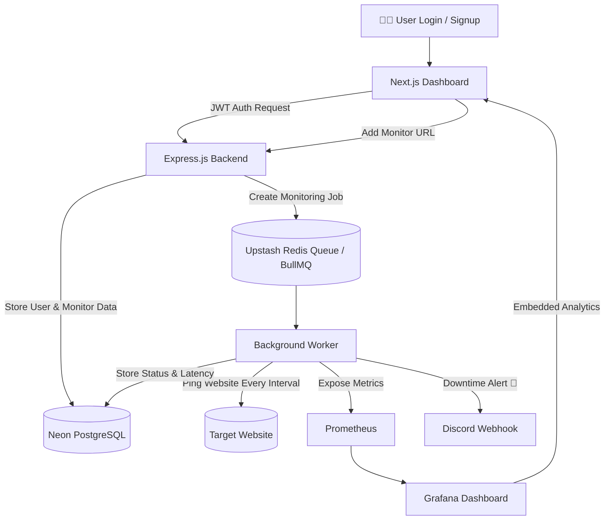

<div align="center">
  
# 🗼 WatchTower

### A Distributed, Real-Time Website Monitoring & Observability Platform

[](#)
[](#)
[](#)
[](#)
[](#)
[](#)
[](#)

</div>

<br/>

> 🚀 **Watch the Demo:** [Insert Demo Link Here]

---

# ⚡ The Engineering Challenge

Building a simple uptime checker with `setInterval()` is easy.

But building a **scalable distributed monitoring system** that can:

- Monitor thousands of URLs
- Run concurrent background jobs
- Maintain queue/database consistency
- Record historical latency metrics
- Isolate user infrastructure securely
- Trigger instant downtime alerts
- Visualize metrics in real-time

...is a completely different engineering problem.

WatchTower was built as an intensive backend engineering project focused on:

- Distributed Workers
- Message Queues
- Persistent State Synchronization
- Observability Engineering
- Real-Time Metrics Pipelines

---

# 🏗️ Monitoring Lifecycle Architecture

WatchTower completely decouples the user-facing API from the heavy lifting of background pinging.



---

# 🧠 Core Engineering Decisions

## 1️⃣ BullMQ + Redis vs Native Timers

Instead of relying on `setInterval()` or `node-cron`, WatchTower delegates all monitoring tasks to BullMQ powered by Upstash Redis.

### Why?

Node.js runs on a single-threaded event loop.

Pinging hundreds of websites simultaneously using native timers can:

- Block the event loop
- Delay API responses
- Cause unstable scheduling
- Crash under scale

By offloading monitoring jobs into Redis-backed queues, WatchTower achieves:

✅ Concurrent job processing  
✅ Distributed background workers  
✅ Automatic retry handling  
✅ Horizontal scalability  
✅ Reliable task persistence  

This architecture separates user-facing traffic from heavy background processing.

---

## 2️⃣ Solving the "Ghost Job" Synchronization Problem

### The Problem

Deleting a monitor from PostgreSQL removed it from the UI...

…but the BullMQ worker continued pinging the website in the background.

Why?

Because the repeatable BullMQ job still existed inside Redis memory.

This created a distributed state inconsistency:

```txt
Postgres → Monitor Deleted ✅
Redis Queue → Job Still Active ❌
```

Also known as:

> 👻 Ghost Jobs

---

### The Solution

A synchronized cleanup controller was engineered.

When a monitor is deleted:

1. Remove monitor row from PostgreSQL
2. Fetch active BullMQ repeatable jobs
3. Find matching job using `monitor-${id}` naming convention
4. Remove repeatable job key from Redis
5. Worker automatically stops future executions

This ensured proper consistency between:

- Persistent Storage → PostgreSQL
- In-Memory Queue → Redis

---

## 3️⃣ Multi-Tenant Grafana Architecture

### The Challenge

How do you securely embed Grafana dashboards into a Next.js app while ensuring:

- User A cannot access User B’s metrics
- No manual dashboard duplication
- Dynamic metric filtering at runtime

---

### The Solution

WatchTower uses a single centralized Grafana dashboard powered by PromQL variables.

The frontend dynamically injects:

```txt
&var-url=<monitor-url>
```

directly into embedded Grafana iframe URLs.

This creates the illusion of:

> thousands of isolated dashboards

while maintaining:

✅ one centralized Grafana configuration  
✅ dynamic filtering  
✅ multi-tenant observability  

---

# 🚀 Key Features

## 🔐 Secure Multi-Tenant Isolation

- JWT Authentication
- Per-user monitor isolation
- Protected monitoring APIs

---

## ⚙️ Distributed Monitoring Workers

- BullMQ repeatable jobs
- Concurrent URL monitoring
- Retry-safe background execution

---

## 📊 Real-Time Observability

Embedded Grafana dashboards displaying:

- Uptime %
- Latency trends
- Response times
- Failure logs

---

## 🚨 Instant Incident Alerts

Automatic Discord webhook triggers when:

- Website goes down
- Request times out
- 4xx/5xx errors occur

---

## 📈 Prometheus Metrics Pipeline

Prometheus continuously collects:

- Request counters
- Response latency
- Health metrics
- Monitoring statistics

---

# 💻 Tech Stack

## Frontend

- Next.js (App Router)
- Tailwind CSS
- Glassmorphism UI

---

## Backend

- Node.js
- Express.js
- JWT Authentication

---

## Database

- Neon PostgreSQL

---

## Queue & Distributed Workers

- Upstash Redis
- BullMQ

---

## Observability

- Prometheus
- Grafana

---

# 🐳 Containerized Infrastructure

WatchTower runs using a fully containerized observability stack powered by Docker Compose.

Instead of manually starting services individually, the complete monitoring infrastructure boots with a single command.

---

## ⚙️ Docker Compose Architecture

```yaml
version: '3.8'

services:
  app:
    build: .
    container_name: watchtower-app

    ports:
      - "3000:3000"

    env_file:
      - .env

    depends_on:
      - prometheus

    restart: always

  prometheus:
    image: prom/prometheus
    container_name: prometheus

    volumes:
      - ./prometheus.yml:/etc/prometheus/prometheus.yml

    ports:
      - "9090:9090"

    restart: always

  grafana:
    image: grafana/grafana
    container_name: grafana

    ports:
      - "3001:3000"

    environment:
      - GF_SECURITY_ADMIN_PASSWORD=admin
      - GF_SECURITY_ALLOW_EMBEDDING=true
      - GF_AUTH_ANONYMOUS_ENABLED=true
      - GF_AUTH_ANONYMOUS_ORG_ROLE=Viewer

    depends_on:
      - prometheus

    restart: always

    volumes:
      - grafana_data:/var/lib/grafana

volumes:
  grafana_data:
```

---

# 🛠️ Getting Started

## 1️⃣ Clone Repository

```bash
git clone <your-repository-url>
cd WatchTower
```

---

## 2️⃣ Install Dependencies

```bash
npm install
```

---

## 3️⃣ Configure Environment Variables

Create a `.env` file:

```env
DATABASE_URL=your_neon_database_url
PORT=3000
JWT_SECRET=your_secret_key
REDIS_URL=your_upstash_redis_url
DISCORD_WEBHOOK_URL=your_discord_webhook
```

---

## 4️⃣ Start Entire Monitoring Stack

```bash
docker compose up --build
```

This automatically starts:

✅ Express.js API  
✅ BullMQ Workers  
✅ Prometheus  
✅ Grafana  

---

# 📊 Local Service URLs

| Service | URL |
|---|---|
| Backend API | http://localhost:3000 |
| Prometheus | http://localhost:9090 |
| Grafana | http://localhost:3001 |

---

# 🔐 Default Grafana Credentials

```txt
Username: admin
Password: admin
```

---

# 📚 Engineering Concepts Explored

This project deeply explores:

- Distributed Systems
- Queue-Based Architectures
- Background Workers
- Event Loop Optimization
- State Synchronization
- Multi-Tenant Systems
- Metrics Pipelines
- Observability Engineering
- Infrastructure Monitoring
- Real-Time Analytics

---

<div align="center">

### ⭐ If you found this project interesting, consider giving it a star ⭐

</div>
